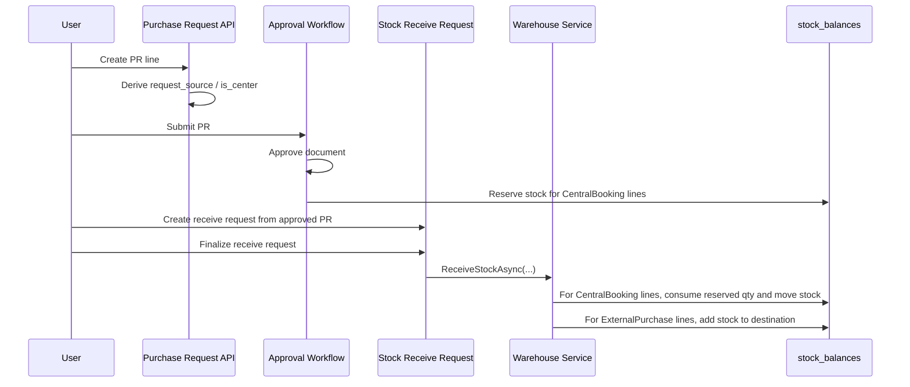

# Warehouse Process & PR Routing Design

> เอกสารฉบับนี้อธิบาย flow คลังสินค้าและการจัดซื้อของ JBFarmHUB ตามแนวคิดล่าสุด: **Purchase Request เป็นตัวกลางหลักของการขอสินค้า**, ระบบเป็นคน route เองว่า line ใดเป็น `CentralBooking` หรือ `ExternalPurchase`, และขั้นตอนรับเข้าคลังจะเป็นคน consume reservation ของ central line เมื่อ finalize

---

## สารบัญ

1. [ภาพรวมแนวคิด](#1-ภาพรวมแนวคิด)
2. [สถานะของคลังและ source ของสินค้า](#2-สถานะของคลังและ-source-ของสินค้า)
3. [Schema ที่เกี่ยวข้อง](#3-schema-ที่เกี่ยวข้อง)
4. [Flow หลัก: Create PR -> Approve -> Receive](#4-flow-หลัก-create-pr---approve---receive)
5. [Flow แยก: เบิกใช้ stock ฟาร์ม](#5-flow-แยก-เบิกใช้-stock-ฟาร์ม)
6. [UI Contract](#6-ui-contract)
7. [Business Rules Summary](#7-business-rules-summary)
8. [ตัวอย่าง Scenario แบบละเอียด](#8-ตัวอย่าง-scenario-แบบละเอียด)
9. [สิ่งที่ตัดออกจาก design เดิม](#9-สิ่งที่ตัดออกจาก-design-เดิม)

---

## 1. ภาพรวมแนวคิด

แนวคิดหลักของระบบนี้มี 4 ข้อ:

1. `items` คือ master หลักของสินค้า
2. `central_warehouse_items` คือ catalog/policy ของ **central item**
3. `PurchaseRequest` ใช้เป็นเอกสารกลางของการขอสินค้า ไม่ให้ user เลือก source เอง
4. `stock_issue_requests` ใช้กับการเบิกใช้ stock ฟาร์ม แยกจาก PR

### กฎ routing หลัก

- ถ้าเป็น PR ของฟาร์ม และ item อยู่ใน `central_warehouse_items` -> line จะ route เป็น `CentralBooking`
- ถ้าเป็น PR ของฟาร์ม และ item ไม่อยู่ใน `central_warehouse_items` -> line จะ route เป็น `ExternalPurchase`
- ถ้าเป็น PR ของ `JBF Central` -> ทุก line จะ route เป็น `ExternalPurchase`
- 1 item = 1 line
- ไม่มี split line ตาม stock
- ไม่มี fallback จาก `CentralBooking` ไป `ExternalPurchase` เพราะ stock ไม่พอ

### ความหมายของ central item

- `central item` ไม่ได้แปลว่า “มีของพอหรือไม่พอ”
- `central item` แปลว่า “item นี้ต้องวิ่งผ่าน central flow”
- ใน business flow ปกติ central item ถือว่ามี stock ในคลังกลางเสมอ
- ถ้าระบบเช็กแล้วไม่พบ stock เป็น error ของข้อมูล ไม่ใช่เหตุผลให้ route ไปซื้อภายนอก

---

## 2. สถานะของคลังและ source ของสินค้า

ระบบไม่ได้ใช้ `stock_balance` มาตัดสิน route ของ PR

สิ่งที่ใช้ตัดสิน route คือ:

- `facility_nodes.is_central_hub`
- `central_warehouse_items`
- ประเภทของ item ใน item master

### ความหมายของสถานที่

| ประเภท | ความหมาย |
|---|---|
| `Farm Warehouse` | คลังของฟาร์ม ใช้รับของจาก central หรือจาก vendor ตาม route ของ line |
| `Central Hub` | คลังกลางของระบบ ใช้ซื้อจากภายนอกอย่างเดียว และเป็น source ของ central booking |

### ความหมายของ source ใน line

| Source | ความหมาย |
|---|---|
| `ExternalPurchase` | ซื้อจาก vendor ภายนอก |
| `CentralBooking` | ขอ/จอง/รับจากคลังกลางตาม policy |

> หมายเหตุ: ใน UI ให้แสดงเป็น `คลังกลาง` และ `ซื้อภายนอก` ตาม source จริง แต่ไม่ให้ user เลือกเอง

---

## 3. Schema ที่เกี่ยวข้อง

### `purchase_requests`

เก็บ header ของเอกสาร PR

- `document_number`
- `request_date`
- `requestor_id`
- `facility_id`
- `destination_warehouse_id`
- `request_type`
- `urgency`
- `status`
- `remarks`

### `purchase_request_lines`

เก็บข้อมูลของแต่ละ line

- `item_id` หรือ `pig_item_id`
- `quantity`
- `uom_id`
- `estimated_price`
- `request_source`
- `is_center`
- `source_warehouse_id`
- `reserved_quantity`
- `issued_quantity`

### `central_warehouse_items`

เก็บ policy/catalog ของ item ที่อยู่ฝั่งคลังกลาง

- `warehouse_id`
- `item_id`
- `is_center_item`
- `min_booking_quantity`
- `max_booking_quantity`

### `facility_nodes`

เก็บ flag ว่าสถานที่นี้คือ hub กลางหรือไม่

- `is_central_hub`

### `stock_balances`

เก็บ stock คงเหลือและยอด reservation

- `quantity`
- `reserved_quantity`

### `stock_receive_requests`

เก็บใบรับเข้าที่สร้างจาก PR ที่ approved แล้ว

- `purchase_request_id`
- `warehouse_id`
- `status`
- `completed_date`

### `stock_issue_requests`

เก็บใบขอเบิก stock ฟาร์ม แยกจาก PR

---

## 4. Flow หลัก: Create PR -> Approve -> Receive

```mermaid
flowchart LR
    A["Open Purchase Request"] --> B["Select item from item master"]
    B --> C["System checks facility_nodes.is_central_hub"]
    C --> D["System checks central_warehouse_items"]
    D -->|"farm + central item"| E["Set line request_source = CentralBooking"]
    D -->|"farm + normal item"| F["Set line request_source = ExternalPurchase"]
    C -->|"central hub"| F
    E --> G["Save draft PR line"]
    F --> G
    G --> H["Submit PR"]
    H --> I["Approval workflow"]
    I -->|"Approved"| J["Reserve stock for central lines"]
    I -->|"Rejected/Returned/Cancelled"| K["Release reserved stock"]
    J --> L["Create receive request from approved PR"]
    L --> M["Finalize receive request"]
    M --> N["Consume reservation + update stock_balance"]
```

### 4.1 Create PR

หน้าสร้าง PR ต้องเก็บเฉพาะข้อมูลที่ user ตัดสินใจจริง:

- item
- UOM
- quantity
- estimated price
- remark

สิ่งที่ **user ไม่ต้องเลือก**:

- source
- central booking / external purchase
- warehouse source

ระบบจะ derive เองจาก:

- facility
- item master
- `central_warehouse_items`

### 4.2 Submit / Approve

เมื่อ submit:

- PR เข้า approval workflow
- ยังไม่ reserve stock

เมื่อ approve:

- line ที่เป็น `CentralBooking` จะ reserve stock ที่ `stock_balances.reserved_quantity`
- line ที่เป็น `ExternalPurchase` จะไม่ reserve stock กลาง

เมื่อ reject / return / cancel:

- release reservation เฉพาะ line ที่เป็น `CentralBooking`

### 4.3 Receive / Finalize

หลัง PR approved แล้ว จะมี flow รับเข้าที่หน้า `Material Stock`

หลักการทำงาน:

1. PR ที่ approved จะปรากฏในรายงานรับเข้า
2. ผู้ใช้สร้าง `stock_receive_request` จาก PR
3. ผู้ใช้กรอกข้อมูลรับเข้า เช่น วันรับ, ผู้รับ, lot, expiry, cost
4. เมื่อ finalize:
   - ถ้า line เป็น `CentralBooking` ระบบจะ consume reservation จากคลังกลางและย้าย stock เข้าคลังปลายทาง
   - ถ้า line เป็น `ExternalPurchase` ระบบจะรับเข้าเข้าคลังปลายทางแบบ receive ปกติ

### Sequence Diagram

---

## 5. Flow แยก: เบิกใช้ stock ฟาร์ม

ถ้าฟาร์มมี stock ของตัวเองและต้องการนำไปใช้:

- ไม่ใช้ PR
- ใช้ `StockIssueRequest`
- workflow การอนุมัติแยกจาก PR
- reservation ของ stock issue request แยกจาก reservation ของ central booking

### เหตุผลที่แยก

- PR ใช้สำหรับขอสินค้าใหม่หรือขอจาก central
- stock issue ใช้สำหรับใช้ stock ที่มีอยู่ในคลังฟาร์ม
- ถ้าเอามาปนกันจะทำให้ flow สับสนและ audit ยาก

---

## 6. UI Contract

### หน้าสร้าง PR

ไฟล์ที่เกี่ยวข้อง:

- `frontend/src/features/production/purchase/components/CreatePRDialog.tsx`
- `frontend/src/features/production/purchase/PurchasePage.tsx`

สิ่งที่ UI ต้องทำ:

- แสดง item master เป็นตัวเลือกหลัก
- แสดง source แบบ read-only ถ้าต้องโชว์ เช่น `คลังกลาง` หรือ `ซื้อภายนอก`
- ไม่ให้ user เลือก source เอง
- ไม่ให้มีการ split line ตาม stock
- ไม่ให้มีข้อความ `center_config`

### หน้ารับเข้า

ไฟล์ที่เกี่ยวข้อง:

- `frontend/src/features/production/stock/StockPage.tsx`
- `frontend/src/features/production/stock/components/ReceivePurchaseRequestDialog.tsx`
- `frontend/src/features/production/stock/components/StockReceiveRequestDetailsDialog.tsx`

สิ่งที่ UI ต้องทำ:

- แสดง PR ที่ approved แล้วในรายงานรับเข้า
- ให้สร้าง receive request จาก PR ได้
- ให้ finalize รับเข้าคลังได้
- เมื่อ finalize แล้ว PR line ที่เป็น `CentralBooking` ต้องไปลด reservation และ stock กลางต้องถูก consume

### หน้ารายละเอียด PR

สิ่งที่ UI ควรแสดง:

- source ของ line แบบ read-only
- `คลังกลาง` สำหรับ central booking
- `ซื้อภายนอก` สำหรับ external purchase

สิ่งที่ไม่ควรทำ:

- ไม่โชว์ field source ให้ user กรอก
- ไม่โชว์ logic ภายในเป็นคำว่า `center_config`
- ไม่โชว์ flow split stock ฟาร์ม

---

## 7. Business Rules Summary

1. `JBF Central` ซื้อจากภายนอกอย่างเดียว
2. ฟาร์มอื่นใช้ PR ได้ 2 ทาง:
   - ผ่านคลังกลาง
   - ซื้อภายนอก
3. item มาจาก item master
4. `central_warehouse_items` ใช้ตัดสินว่า item ไหนเป็น central item
5. `stock_balances.reserved_quantity` เป็นยอด reservation จริง
6. reserve เกิดตอน approve
7. consume reservation เกิดตอน finalize receive
8. ถ้ายกเลิก/ตีกลับ/ไม่อนุมัติ ให้ release reservation
9. เบิกใช้ stock ฟาร์มต้องไป `StockIssueRequest`
10. ไม่มี split line ตาม stock

---

## 8. ตัวอย่าง Scenario แบบละเอียด

### Scenario 1: Farm PR + central item

ผู้ใช้ฟาร์ม A เปิด PR แล้วเลือก item ที่อยู่ใน `central_warehouse_items`

ผลลัพธ์:

- line ถูกบันทึกเป็น `CentralBooking`
- `source_warehouse_id` ชี้ไปที่คลังกลาง
- ตอน approve ระบบ reserve stock กลาง
- ตอน finalize receive ระบบ consume reservation และย้าย stock เข้า farm warehouse

### Scenario 2: Farm PR + normal item

ผู้ใช้ฟาร์ม A เลือก item ที่ไม่อยู่ใน `central_warehouse_items`

ผลลัพธ์:

- line ถูกบันทึกเป็น `ExternalPurchase`
- `source_warehouse_id = null`
- ไม่ reserve stock กลาง
- ตอน finalize receive รับเข้าเข้าคลังปลายทางตาม receive ปกติ

### Scenario 3: PR ของ JBF Central

ผู้ใช้ใน JBF Central สร้าง PR

ผลลัพธ์:

- ทุก line เป็น `ExternalPurchase`
- ใช้สำหรับซื้อจาก vendor ภายนอกเข้าคลังกลาง
- ไม่ route เป็น `CentralBooking`

### Scenario 4: ฟาร์มมีของอยู่แล้ว

ถ้าฟาร์มต้องการใช้ stock ที่มีอยู่:

- ไม่สร้าง PR
- ใช้ `StockIssueRequest`
- flow นี้แยกจาก PR และแยกจาก central booking

---

## 9. สิ่งที่ตัดออกจาก design เดิม

เอกสารและระบบเดิมเคยมีแนวคิดเหล่านี้ แต่ตอนนี้ไม่ใช่ flow หลักแล้ว:

- booking เป็นระบบแยก
- user เลือก source เอง
- split line ตาม stock คลังฟาร์ม
- fallback จาก central ไป external เพราะ stock ไม่พอ
- `center_config` wording
- หน้าสร้าง PR ที่พยายามคิดแทน user ว่าต้องแยกของมาจากไหน

> สรุป: design ล่าสุดคือ **PR routing by central item** ไม่ใช่ **stock booking แยก**

