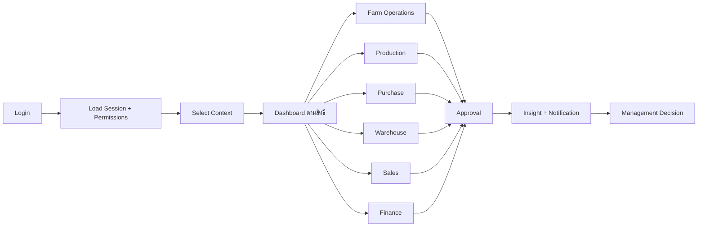
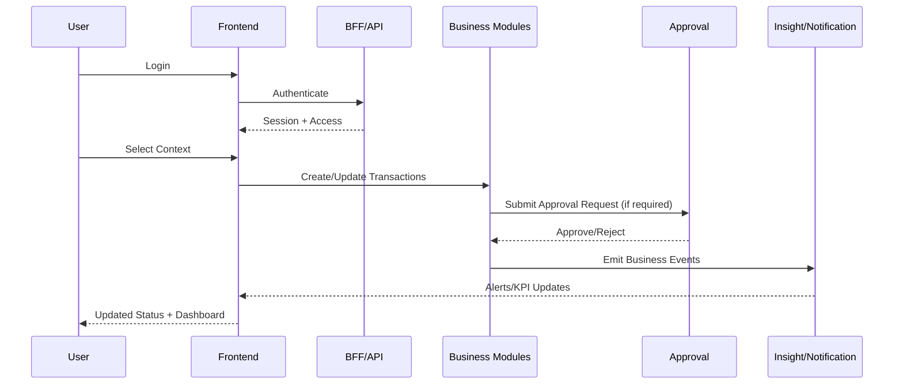

# 01_workflow_overview.md

## วัตถุประสงค์
เอกสารนี้อธิบายภาพรวมการไหลงานของระบบ FarmHUB ตั้งแต่ผู้ใช้เข้าสู่ระบบจนจบวงจรธุรกรรมในแต่ละโมดูล พร้อมจุดเชื่อมต่อข้ามโมดูลที่ต้องสอดคล้องกัน

## ขอบเขต
- Login / Session / Context Selection
- Dashboard + Navigation ตามสิทธิ์
- ธุรกรรมหลัก: Farm, Production, Purchase, Warehouse, Sales, Finance
- งานกำกับ: Access, Approval, Insight, Notification, Setting, Document

## ผู้เกี่ยวข้องหลัก
- ผู้ปฏิบัติงานฟาร์ม
- หัวหน้าหน่วยงาน / ผู้อนุมัติ
- แผนกจัดซื้อ คลัง ขาย การเงิน
- ผู้ดูแลระบบ (Admin)

## อินพุตหลัก
- ข้อมูลผู้ใช้และสิทธิ์
- Master Data และ Setting
- ธุรกรรมรายวันจากแต่ละโมดูล

## เอาต์พุตหลัก
- ข้อมูลสถานะธุรกรรมล่าสุด
- รายงานภาพรวมและ KPI
- งานอนุมัติและการแจ้งเตือน

## Mermaid Flow (System-Level)

## Mermaid Sequence (High Level)

## ขั้นตอนการทำงานหลัก (Happy Path)
1. ผู้ใช้ login ผ่านหน้าระบบยืนยันตัวตน
2. ระบบโหลด session, role, permission และ scope
3. ถ้าผู้ใช้มีหลาย assignment ระบบให้เลือก context
4. ระบบสร้างเมนูและ route ที่เข้าถึงได้ตาม effective access
5. ผู้ใช้ทำธุรกรรมในโมดูลที่เกี่ยวข้อง
6. ธุรกรรมที่ต้องอนุมัติถูกส่งเข้ากล่องงานอนุมัติ
7. หลังอนุมัติ ระบบเปลี่ยนสถานะและกระทบโมดูลปลายทาง
8. ระบบส่ง event เข้า insight/notification
9. Dashboard และรายงานแสดงผลล่าสุดให้ผู้ใช้ตามสิทธิ์

## ทางเลือกและข้อยกเว้น
- Login ไม่สำเร็จ: แสดงเหตุผล + จำกัดการลองซ้ำ
- Session หมดอายุ: บังคับ refresh หรือกลับ login
- Context ไม่ถูกต้อง: ไม่อนุญาตเข้าหน้างาน
- Approval ถูกปฏิเสธ: ส่งกลับต้นทางเพื่อแก้ไข
- Integration fail: เข้า retry/reconcile queue

## Validation และ Business Rules กลาง
- ทุกธุรกรรมต้องมี context ปัจจุบัน
- ทุกคำสั่งเขียนข้อมูลต้องตรวจ permission + scope
- ห้ามข้ามลำดับสถานะ (เช่น draft -> approved โดยไม่มีขั้นอนุมัติ)
- ทุกโมดูลต้องสร้าง audit trail เมื่อ create/update/delete

## จุดเชื่อมต่อโมดูล (Cross-Module Contract)
- Purchase -> Warehouse: รับเข้าจากเอกสารจัดซื้อ
- Warehouse -> Finance: ต้นทุน/มูลค่าสินค้าคงคลัง
- Sales -> Finance: รายได้และเอกสารเรียกเก็บ
- Farm/Production/Health -> Insight: KPI + alert signals
- Approval -> ทุกโมดูล: สถานะอนุมัติกลาง

## Notification/Event หลัก
- Submitted for approval
- Approved / Rejected
- Stock low / Expiry near
- Health risk event
- Financial period close mismatch

## Audit และ Traceability
- เก็บ user, timestamp, before/after state
- เชื่อม relation ระหว่างเอกสารต้นทางกับปลายทาง
- รองรับการตรวจย้อนหลังตามเลขเอกสารและ context

## KPI กลางที่ควรติดตาม
- ระยะเวลาจากสร้างเอกสารถึงปิดงาน
- Approval lead time
- Error/retry rate ของ integration
- % งานที่ค้างเกิน SLA

## Checklist การนำไปใช้
- [ ] Route guard ใช้ effective access เดียวกันทั้งระบบ
- [ ] State transition บังคับตาม business rule
- [ ] มี event และ notification ครบจุดสำคัญ
- [ ] มี dashboard summary ที่สะท้อนธุรกรรมจริง
