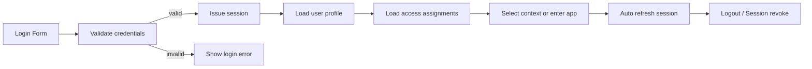
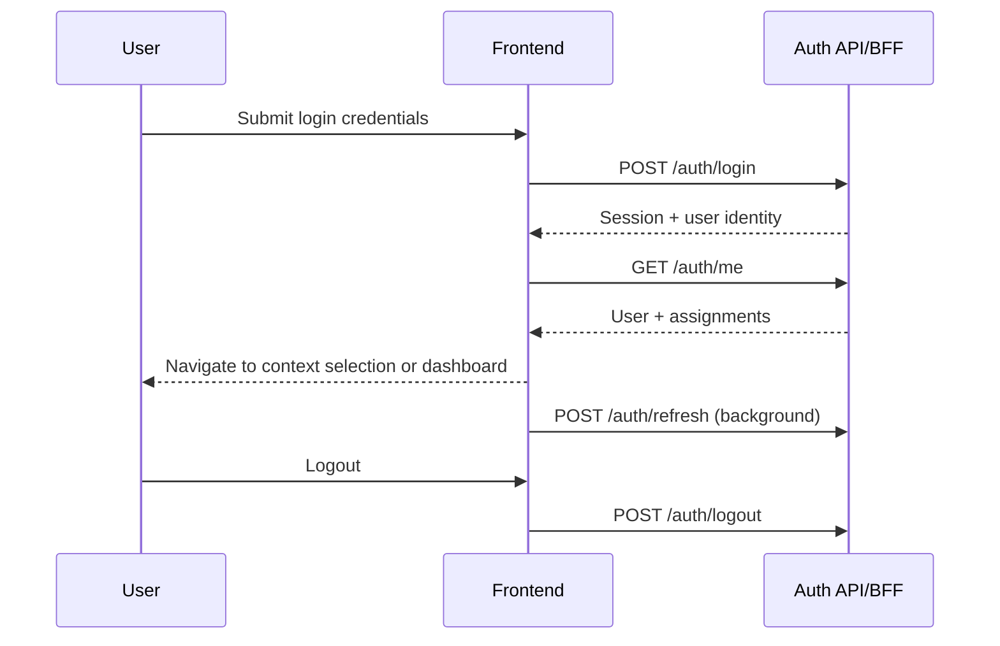

# 02_workflow_auth.md

## วัตถุประสงค์
กำหนดขั้นตอน Authentication และ Session Lifecycle ให้ใช้งานได้เสถียร ปลอดภัย และรองรับการทำงานจริงทั้ง desktop/mobile

## ขอบเขตโมดูล
- Login
- Refresh Session
- Logout
- Load Current User

## ผู้เกี่ยวข้องหลัก
- ผู้ใช้งานทุกบทบาท
- ระบบ Auth/BFF
- ระบบ Access (Role/Permission/Scope)

## อินพุตหลัก
- Username / Password
- Device / Browser Session Context

## เอาต์พุตหลัก
- Session Token (ผ่าน BFF policy)
- Current user profile
- Assignment/Access list

## Mermaid Flow

## Mermaid Sequence

## ขั้นตอนการทำงานหลัก
1. ผู้ใช้กรอกบัญชีและรหัสผ่าน
2. FE ตรวจสอบรูปแบบข้อมูลก่อนส่ง API
3. Auth API ตรวจสอบ credential และสถานะ user
4. เมื่อสำเร็จ ระบบออก session ตาม policy
5. FE โหลด profile + assignment เพื่อคำนวณ context
6. ถ้ามีหลาย assignment ให้ไปหน้าจัดเลือก context
7. ระหว่างใช้งานมี refresh ตามช่วงเวลา/401 handling
8. Logout จะ revoke session และ clear client state

## ทางเลือกและข้อยกเว้น
- บัญชีถูกปิด: แจ้งสถานะ account disabled
- รหัสผ่านผิดเกินจำนวนที่กำหนด: ล็อกชั่วคราว
- Refresh ไม่สำเร็จ: redirect login แบบปลอดภัย
- Network ขัดข้อง: แสดง recoverable error และ retry

## Validation และกติกา
- ห้ามเข้าหน้า protected ถ้าไม่มี session
- ทุก API สำคัญต้องตรวจ auth server-side
- Session ต้องผูกนโยบายหมดอายุที่ชัดเจน

## Security Checklist
- [ ] ไม่เก็บ token ในที่ที่เสี่ยง (ตาม policy โปรเจกต์)
- [ ] ป้องกัน session fixation
- [ ] มี logout ทุกอุปกรณ์ (ถ้านโยบายกำหนด)
- [ ] ปิดช่องโหว่ redirect ไม่ปลอดภัย

## KPI
- Login success rate
- Refresh failure rate
- Average login latency
- Forced logout incidents
