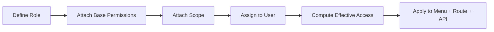
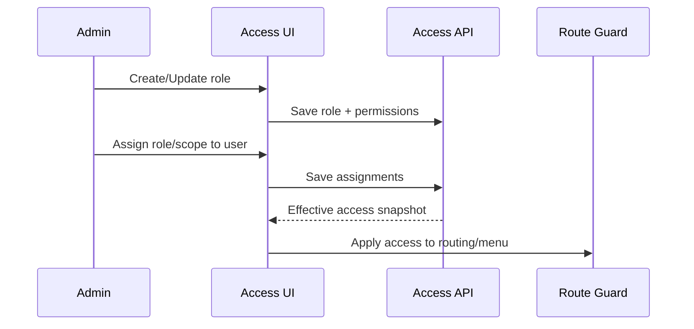

# 03_workflow_access.md

## วัตถุประสงค์
กำหนดการจัดการสิทธิ์แบบ Role + Permission + Scope ให้ใช้งานง่ายใน UI และ enforce ได้จริงกับ route/API

## ขอบเขตโมดูล
- ผู้ใช้
- บทบาท
- สิทธิ์ (permission pool)
- พื้นที่/ขอบเขต (farm/phase/house)

## ผู้เกี่ยวข้องหลัก
- System Admin
- ผู้จัดการหน่วยงาน
- Audit/Compliance

## อินพุตหลัก
- โครง role
- permission code
- assignment รายผู้ใช้
- scope hierarchy

## เอาต์พุตหลัก
- effective access ต่อผู้ใช้
- เมนู/route ที่เห็นได้
- สิทธิ์ปุ่ม/การกระทำรายหน้า

## Mermaid Flow

## Mermaid Sequence

## ขั้นตอนการทำงานหลัก
1. ผู้ดูแลสร้างหรือแก้ role
2. เลือก permission จาก permission pool
3. เลือก scope ที่ role นี้ครอบคลุม
4. ผูก assignment เข้าผู้ใช้ (หลายชุดได้)
5. ระบบคำนวณ effective access (รวม role หลายชุด)
6. FE ใช้ผลลัพธ์เดียวกันกับ menu, route guard, button visibility

## ทางเลือกและข้อยกเว้น
- role ไม่มี permission: ใช้เข้าเมนูไม่ได้
- scope ไม่ครบ: เห็นเมนูแต่ไม่เห็นข้อมูลบางส่วน
- permission conflict: ใช้ rule precedence ที่กำหนด

## กติกาสำคัญ
- Permission code ต้องไม่ซ้ำ
- Scope ต้องเป็นโหนดที่ valid ตาม hierarchy
- ลบ role ที่ถูกใช้งานต้องมีขั้นตอนป้องกัน impact

## Mapping 2 ขั้น (แนะนำ)
1. Backend permission -> Frontend module permission
2. Frontend module permission -> Menu/Route action permission

## KPI
- เวลาเฉลี่ยในการกำหนดสิทธิ์ผู้ใช้ใหม่
- จำนวน incident จากสิทธิ์ไม่ถูกต้อง
- % การตรวจสิทธิ์ผ่าน guard ก่อนเรียก API
