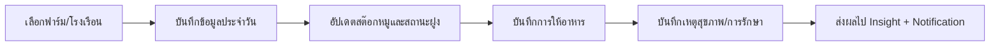

# 04_workflow_farm.md

## วัตถุประสงค์
อธิบายวงจรข้อมูลหน้างานฟาร์มจากการบันทึกประจำวันไปจนถึงข้อมูลสุขภาพและผลกระทบเชิงปฏิบัติการ

## ขอบเขตโมดูล
- บันทึกข้อมูลประจำวัน
- ข้อมูลรายฟาร์ม
- สต๊อกหมู
- การให้อาหาร
- สุขภาพและการรักษา

## ผู้เกี่ยวข้องหลัก
- เจ้าหน้าที่ฟาร์ม
- ผู้จัดการฟาร์ม
- สัตวแพทย์/ทีมสุขภาพ

## Mermaid Flow

## ขั้นตอนการทำงานหลัก
1. ผู้ใช้เลือก context ฟาร์ม/เฟส/โรงเรือน
2. กรอกข้อมูลกิจกรรมรายวัน (รับเข้า/ย้าย/สูญเสีย/น้ำหนัก ฯลฯ)
3. ระบบคำนวณผลกระทบต่อ stock และข้อมูลฝูง
4. กิจกรรมการให้อาหารถูกบันทึกพร้อมสูตร/ปริมาณ
5. เมื่อพบปัญหาสุขภาพ สร้างเคสและแผนรักษา
6. ระบบสร้างสัญญาณเตือนตามกฎ (เช่น อัตราตายผิดปกติ)

## อินพุตสำคัญ
- master data: ประเภทการเลี้ยง, สายพันธุ์, กลุ่มโรค
- scope: farm/phase/house
- เอกสารจากคลัง (อาหาร/ยา)

## เอาต์พุตสำคัญ
- สถานะฝูงล่าสุด
- consumption report
- health incident log

## ทางเลือกและข้อยกเว้น
- ข้อมูลซ้ำวันเดียวกัน: merge หรือ block ตาม rule
- จำนวนติดลบหลังคำนวณ: แจ้งเตือน validation
- context mismatch: บล็อกการบันทึก

## Business Rules
- ห้ามบันทึกเกินขอบเขต scope ของผู้ใช้
- รายการที่กระทบ stock ต้อง trace ไป transaction ต้นทาง
- กรณีรักษาต้องผูกประเภทการรักษาและเหตุโรค

## KPI
- ความครบถ้วนข้อมูลรายวัน (%)
- Feed conversion proxy
- Health incident response time
