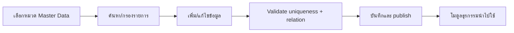

# 05_workflow_master.md

## วัตถุประสงค์
วางมาตรฐานการดูแลข้อมูลหลัก (Master Data) ที่ทุกโมดูลใช้อ้างอิงร่วมกัน

## ขอบเขตโมดูล
- ประเภทการเลี้ยง / สายพันธุ์ / กลุ่มโรค
- ประเภทการรักษา / ประเภทการสูญเสีย / สาเหตุการตาย
- รายการสินค้า / หมวดสินค้า / หน่วยนับ / แปลงหน่วย
- นโยบายล็อตและวันหมดอายุ / คู่ค้า / กฎการแจ้งเตือน

## Mermaid Flow

## ขั้นตอนการทำงานหลัก
1. ผู้ดูแลเลือกแท็บ master data ที่ต้องการ
2. ตรวจสอบข้อมูลเดิมผ่าน search/filter
3. เพิ่มหรือแก้รายการพร้อม field จำเป็น
4. ระบบตรวจ format, unique key, relation constraints
5. บันทึกสำเร็จแล้วเผยแพร่ค่าให้โมดูลที่ใช้อ้างอิง

## Validation สำคัญ
- code ต้องไม่ซ้ำในหมวดเดียวกัน
- หน่วยแปลงต้องไม่ทำให้วงจร conversion ผิดตรรกะ
- กฎแจ้งเตือนต้องมี threshold และ target ชัดเจน

## จุดเชื่อมต่อ
- Farm/Production ใช้พันธุ์/โรค/การรักษา
- Warehouse/Purchase ใช้สินค้า/หน่วย/คู่ค้า
- Insight ใช้มิติข้อมูลเพื่อรายงาน

## Impact Analysis ที่ควรมี
- ก่อนลบ master data ที่ถูกใช้งาน ต้องบล็อกหรือต้อง migrate
- การเปลี่ยนชื่อ/code ต้องไม่ทำให้รายงานย้อนหลังเสีย

## KPI
- Data quality issue count
- Duplicate prevention rate
- Time to publish master change
