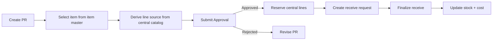

# 06_workflow_purchase.md

## วัตถุประสงค์
กำหนด workflow ของใบขอซื้อ (PR) ตั้งแต่การสร้างเอกสาร, routing ของแต่ละ line, การอนุมัติ, และการรับเข้าคลัง

## ขอบเขตโมดูล
- ใบขอซื้อ (PR)
- การ route ระหว่าง `ExternalPurchase` และ `CentralBooking`
- การรับเข้าคลังจาก PR ที่ approved แล้ว

## Mermaid Flow

## ขั้นตอนการทำงานหลัก
1. ผู้ใช้สร้าง PR จาก item master
2. ระบบตรวจว่า line ไหนเป็น `CentralBooking` หรือ `ExternalPurchase`
3. ผู้ใช้ส่ง PR เข้า approval workflow
4. เมื่ออนุมัติ ระบบ reserve เฉพาะ line ที่เป็น central booking
5. ผู้ใช้สร้าง receive request จาก PR ที่ approved แล้ว
6. เมื่อ finalize receive ระบบอัปเดต stock movement, reservation, และข้อมูลต้นทุน

## อินพุตสำคัญ
- Item master
- `central_warehouse_items`
- `facility_nodes.is_central_hub`
- Approval policy

## เอาต์พุตสำคัญ
- สถานะ PR ล่าสุด
- line source ที่ derive แล้ว
- receive request ที่ผูกกับ PR
- stock movement / cost ที่อัปเดตแล้ว

## ทางเลือกและข้อยกเว้น
- partial receive: รับเข้าได้บางส่วนและ consume reservation เฉพาะส่วนที่รับ
- cancel PR: ต้อง release reservation ของ central lines
- unit mismatch: บังคับแปลงหน่วยหรือ block

## KPI
- PR cycle time
- Approval turnaround time
- Receive variance rate

## Related Detail
ถ้าต้องการดู flow routing แบบละเอียดระหว่าง `ExternalPurchase` กับ `CentralBooking` ให้ดู `19_workflow_purchase-central-routing.md`
