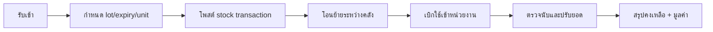

# 07_workflow_warehouse.md

## วัตถุประสงค์
อธิบายกระบวนงานคลังแบบครบวงจร ตั้งแต่รับเข้า โอนย้าย เบิกใช้ จนถึงปรับยอด พร้อมผลกระทบต่อ stock balance และต้นทุน

## ขอบเขตโมดูล
- รับเข้า
- โอนย้าย
- เบิกใช้
- ปรับยอด

## ผู้เกี่ยวข้องหลัก
- เจ้าหน้าที่คลัง
- หัวหน้าคลัง
- หน่วยงานที่เบิกใช้งาน
- การเงิน/ต้นทุน

## Mermaid Flow

## ขั้นตอนการทำงานหลัก
1. รับเข้าสินค้าจาก PR/PO หรือรับเข้าตรง
2. ระบุ lot, expiry, warehouse location และ unit
3. ระบบคำนวณคงเหลือทันทีตาม item+lot+location
4. โอนย้ายภายใน/ข้ามคลังพร้อม trace ต้นทาง-ปลายทาง
5. เบิกใช้เข้าหน้างานโดยอ้างอิงเอกสารที่เกี่ยวข้อง
6. ปรับยอดหลังตรวจนับหรือพบความคลาดเคลื่อน

## Validation และ Business Rules
- ห้ามคงเหลือติดลบ
- lot/expiry ต้องบังคับเมื่อ item policy กำหนด
- โอนย้ายต้องเช็ค source availability ก่อน commit
- ปรับยอดต้องมีเหตุผลประกอบ

## ข้อมูลที่อ่าน/เขียน
- อ่าน: item master, uom conversion, lot policy
- เขียน: stock transaction, stock balance, issue/receive documents

## จุดเชื่อมต่อโมดูล
- Purchase -> Warehouse receive
- Warehouse -> Farm/Production issue
- Warehouse -> Finance costing

## Notification/Event
- stock ต่ำกว่า threshold
- lot ใกล้หมดอายุ
- receive discrepancy

## Audit
- เก็บ ref doc, user, ก่อน/หลังปรับยอด, เหตุผล

## KPI
- stock accuracy
- inventory turnover
- adjustment frequency
