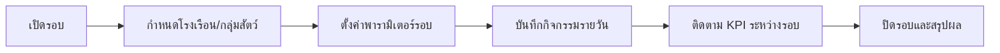

# 08_workflow_production.md

## วัตถุประสงค์
อธิบายการผลิตในระดับรอบงานและโรงเรือน พร้อมจุดวัดผลที่เชื่อมกับฟาร์ม คลัง และการเงิน

## ขอบเขตโมดูล
- เปิดรอบ
- เปิดโรงเรือน
- ติดตามกิจกรรมระหว่างรอบ
- ปิดรอบ

## Mermaid Flow

## ขั้นตอนการทำงานหลัก
1. เปิดรอบใหม่ตามแผนการผลิต
2. กำหนดพื้นที่และจำนวนเริ่มต้น
3. ระบุสูตร/แผนการดูแลตามช่วงเวลา
4. บันทึกเหตุการณ์หน้างานตลอดรอบ
5. ติดตามตัวชี้วัดเช่น growth, mortality, feed consumption
6. ปิดรอบเพื่อส่งผลให้รายงานและต้นทุน

## ทางเลือกและข้อยกเว้น
- ปิดรอบก่อนกำหนด: ต้องบันทึกเหตุผล
- โยกย้ายระหว่างโรงเรือน: ต้องอัปเดต trace ทันที
- ข้อมูลไม่ครบ: บล็อกการปิดรอบ

## Business Rules
- 1 โรงเรือนในช่วงเวลาเดียวกันควรมี active round ตามนโยบาย
- ธุรกรรมที่กระทบ stock ต้องผ่านคลังหรือ transaction กลาง

## จุดเชื่อมต่อ
- Farm: ข้อมูลสุขภาพและการให้อาหาร
- Warehouse: เบิกวัสดุ/อาหาร
- Finance: ต้นทุนต่อรอบ
- Insight: KPI รอบการผลิต

## KPI
- cycle completion rate
- average daily gain (ADG) proxy
- feed efficiency proxy
