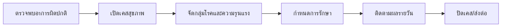

# 09_workflow_health.md

## วัตถุประสงค์
ควบคุมกระบวนการจัดการเหตุการณ์สุขภาพให้ตอบสนองเร็วและมีประวัติครบถ้วน

## ขอบเขตโมดูล
- เปิดเคสสุขภาพ
- วินิจฉัยและแผนรักษา
- ติดตามผล
- ปิดเคส

## Mermaid Flow

## ขั้นตอนการทำงานหลัก
1. เจ้าหน้าที่เปิดเคสพร้อมรายละเอียดอาการ
2. ระบบอ้างอิงกลุ่มโรค/ประเภทรักษาจาก master
3. สร้างแผนรักษาและรายการยาที่ใช้
4. บันทึกผลตอบสนองต่อการรักษาเป็น timeline
5. ปิดเคสเมื่อหายหรือส่งต่อเคสหนัก

## Validation และกติกา
- เคสต้องผูกกับ farm/phase/house ที่ถูกต้อง
- การใช้ยาต้องระบุ dosage/unit
- ห้ามปิดเคสโดยไม่บันทึกผลสรุป

## จุดเชื่อมต่อ
- Farm record: อัปเดตข้อมูลฝูง
- Warehouse: ตัดสต๊อกยา
- Insight: แจ้งเตือนเหตุผิดปกติ

## Notification
- severity สูงกว่าค่า threshold
- อัตราป่วยเกิน baseline
- เคสค้างเกิน SLA

## KPI
- case response time
- treatment success rate
- recurrence rate
