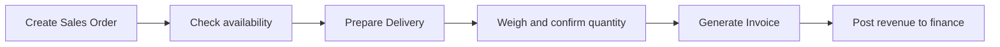

# 10_workflow_sales.md

## วัตถุประสงค์
อธิบายกระบวนการขายให้เชื่อมข้อมูลตั้งแต่คำสั่งขายจนถึงการเงินอย่างครบถ้วน

## ขอบเขตโมดูล
- คำสั่งขาย
- ส่งมอบ
- ชั่ง
- ใบแจ้งหนี้

## Mermaid Flow

## ขั้นตอนการทำงานหลัก
1. เปิดคำสั่งขายจากลูกค้า/คู่ค้า
2. ตรวจสอบปริมาณพร้อมขายและกำหนดกำหนดส่ง
3. จัดส่งสินค้าและบันทึกสถานะการส่งมอบ
4. ชั่งน้ำหนัก/ยืนยันปริมาณจริง
5. ออกใบแจ้งหนี้ตามยอดจริง
6. ส่งผลเข้ารายรับและรายงานการเงิน

## ทางเลือกและข้อยกเว้น
- partial delivery: ออก invoice หลายงวดได้
- น้ำหนักจริงไม่ตรง order: ใช้ rule ปรับยอด
- ยกเลิกคำสั่งขาย: ต้องเช็คเอกสารปลายทางที่ผูกอยู่

## Business Rules
- สถานะเอกสารต้องไหลตามลำดับ SO -> Delivery -> Weigh -> Invoice
- ยอด invoice ต้องอิง quantity ยืนยันสุดท้าย

## จุดเชื่อมต่อ
- Warehouse: ตัด stock ตามส่งมอบ
- Finance: รับรู้รายได้
- Approval: บางกรณีส่วนลด/override

## KPI
- order fulfillment rate
- delivery on-time rate
- invoice lead time
