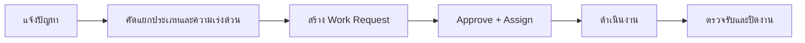

# 11_workflow_maintenance.md

## วัตถุประสงค์
จัดการงานซ่อมบำรุงให้มีวงจรชีวิตงานชัดเจน ตั้งแต่แจ้งงานจนตรวจรับ

## ขอบเขตโมดูล
- แจ้งงาน
- คำขอ
- ใบสั่งงาน

## Mermaid Flow

## ขั้นตอนการทำงานหลัก
1. ผู้ใช้งานแจ้งเหตุซ่อมพร้อมรูป/รายละเอียด
2. ระบบจัดประเภทงานและลำดับความเร่งด่วน
3. ผู้เกี่ยวข้องอนุมัติและมอบหมายทีมปฏิบัติ
4. ทีมซ่อมบันทึกความคืบหน้าและอะไหล่ที่ใช้
5. ผู้ร้องขอตรวจรับก่อนปิดงาน

## Validation
- งานเร่งด่วนสูงต้องมี SLA เฉพาะ
- ปิดงานได้เมื่อมีผลตรวจรับครบ
- อะไหล่ที่ใช้ต้อง trace กับคลัง

## จุดเชื่อมต่อ
- Warehouse: เบิกอะไหล่
- Finance: ต้นทุนซ่อม
- Approval: อนุมัติงบ

## KPI
- mean time to repair
- overdue work orders
- repeat failure rate
