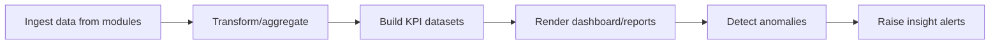

# 13_workflow_insight.md

## วัตถุประสงค์
อธิบายการวิเคราะห์ข้อมูลเชิงบริหารจากข้อมูลข้ามโมดูล และการแปลงเป็นรายงาน/สัญญาณเตือนที่ใช้งานได้จริง

## ขอบเขตโมดูล
- รายงาน
- วิเคราะห์ข้อมูล
- การแจ้งเตือนเชิง insight

## Mermaid Flow

## ขั้นตอนการทำงานหลัก
1. ระบบดึงข้อมูลจากโมดูลธุรกรรมตามรอบเวลา
2. แปลงข้อมูลให้เป็นโครงสร้างสำหรับรายงาน
3. คำนวณ KPI สำคัญตามมิติฟาร์ม/เวลา/สินค้า
4. แสดงผลใน dashboard และรายงาน drill-down
5. ตรวจจับสัญญาณผิดปกติและเตรียม alert

## Validation
- dataset ต้องอ้างอิง source document ที่ตรวจสอบได้
- metric definition ต้องมีเจ้าของและนิยามเดียวกัน

## จุดเชื่อมต่อ
- Farm/Production/Sales/Warehouse/Finance
- Notification system
- Approval monitoring

## KPI ของโมดูล insight
- report generation latency
- data freshness
- anomaly precision (เชิงธุรกิจ)
