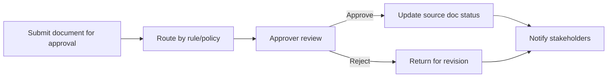

# 14_workflow_approval.md

## วัตถุประสงค์
กำหนดการอนุมัติเอกสารแบบศูนย์กลางให้ควบคุมสถานะธุรกรรมได้โปร่งใสและย้อนตรวจสอบได้

## ขอบเขตโมดูล
- กล่องงานอนุมัติ
- รายละเอียดอนุมัติ
- ประวัติการตัดสินใจ

## Mermaid Flow

## ขั้นตอนการทำงานหลัก
1. โมดูลต้นทางส่งคำขออนุมัติพร้อม metadata
2. ระบบ route ผู้อนุมัติตาม policy
3. ผู้อนุมัติตรวจสอบรายละเอียดและตัดสินใจ
4. สถานะอนุมัติส่งกลับเอกสารต้นทาง
5. แจ้งเตือนผู้สร้างและผู้เกี่ยวข้อง

## ทางเลือกและข้อยกเว้น
- delegation: เปลี่ยนผู้อนุมัติชั่วคราว
- timeout: escalated approval
- multi-step approval: ต้องอนุมัติครบทุกขั้น

## Business Rules
- ห้าม skip step หาก policy ไม่อนุญาต
- ต้องเก็บ reason เมื่อ reject
- ทุก decision ต้องมี timestamp + actor

## KPI
- approval turnaround time
- rejection rate by module
- overdue approvals
