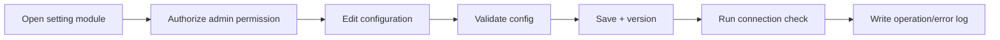

# 16_workflow_setting.md

## วัตถุประสงค์
ควบคุมการตั้งค่าระบบให้ปลอดภัย ตรวจสอบย้อนกลับได้ และลดผลกระทบจาก config ผิดพลาด

## ขอบเขตโมดูล
- ค่าระบบ
- การเชื่อมต่อ
- การตรวจสอบ (audit)

## Mermaid Flow

## ขั้นตอนการทำงานหลัก
1. ผู้ดูแลเปิดหน้าตั้งค่าและยืนยันสิทธิ์
2. แก้ค่า configuration ตามหมวด
3. ระบบ validate รูปแบบและ dependency
4. บันทึกพร้อม version/changed-by
5. ทดสอบการเชื่อมต่อระบบภายนอก
6. บันทึก operation log หรือ error log และแสดงผล

## ข้อยกเว้น
- invalid configuration: rollback ค่าเดิม
- integration timeout: mark degraded state

## KPI
- config change success rate
- integration uptime
- unauthorized setting access attempts
