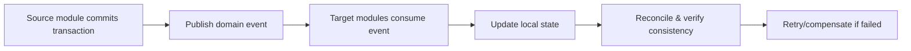

# 17_workflow_cross-module.md

## วัตถุประสงค์
กำหนดแนวทางการไหลข้อมูลข้ามโมดูลให้สอดคล้อง ถูกต้อง และสามารถแก้ไขเมื่อระบบปลายทางล้มเหลวได้

## ขอบเขตโมดูล
- Domain event ระหว่างโมดูล
- Data consistency check
- Retry/Reconcile

## Mermaid Flow

## ขั้นตอนการทำงานหลัก
1. โมดูลต้นทางบันทึกธุรกรรมและสร้าง event
2. โมดูลปลายทางรับ event ตามความรับผิดชอบ
3. อัปเดตข้อมูลปลายทางโดยไม่ทำลำดับสถานะเพี้ยน
4. ตรวจ consistency แบบ scheduled/realtime
5. ถ้าล้มเหลวเข้า retry หรือ compensation flow

## กติกาสำคัญ
- Event ต้องมี idempotency key
- ต้องรองรับ out-of-order event
- การ retry ต้องไม่ทำข้อมูลซ้ำ

## KPI
- cross-module sync delay
- reconcile failure rate
- duplicate event handling success rate
