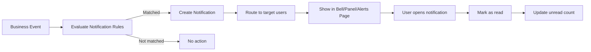
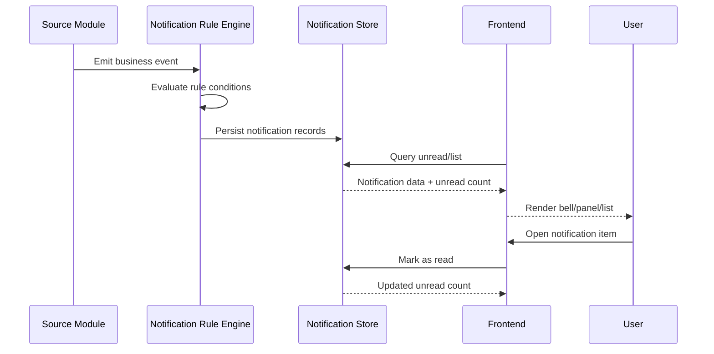

# 18_workflow_notification.md

## วัตถุประสงค์
กำหนดวงจรการแจ้งเตือนตั้งแต่การเกิดเหตุการณ์ธุรกิจ การประเมิน rule ไปจนถึงการแสดงผลและการจัดการสถานะอ่าน

## ขอบเขตโมดูล
- Trigger จาก business events
- Rule evaluation
- Notification store
- In-app bell/panel/list
- Read/Unread lifecycle

## ผู้เกี่ยวข้องหลัก
- ผู้ใช้งานทุกบทบาท
- ผู้ดูแลกฎแจ้งเตือน
- ระบบ Insight/Monitoring

## Mermaid Flow

## Mermaid Sequence

## ขั้นตอนการทำงานหลัก
1. โมดูลธุรกรรมปล่อย event สำคัญ (เช่นอนุมัติ, stock ต่ำ)
2. Rule engine ประเมินเงื่อนไขและ target
3. ระบบสร้าง notification records พร้อม metadata ที่จำเป็น
4. Frontend ดึง unread count และรายการแสดงผล
5. ผู้ใช้คลิกแจ้งเตือนเพื่อไปหน้าเป้าหมาย
6. ระบบ mark as read และอัปเดตตัวนับ

## ทางเลือกและข้อยกเว้น
- Event ซ้ำ: ใช้ idempotency key กัน notify ซ้ำ
- Target user ไม่ active: เก็บคิวไว้/เปลี่ยนช่องทางแจ้งเตือน
- Rule ผิดพลาด: บันทึก error log และ fallback rule

## Business Rules
- ทุก notification ต้องมี: type, source, referenceId, createdAt
- Notification ที่เกี่ยวกับงานอนุมัติต้องชี้ไปเอกสารต้นทางได้
- ผู้ใช้เห็นเฉพาะแจ้งเตือนที่อยู่ใน scope ของตน

## Data Model ที่ควรมี
- notification_id
- user_id
- channel (in-app, email, etc.)
- title / message / severity
- reference_module / reference_id
- is_read / read_at

## จุดเชื่อมต่อกับโมดูลอื่น
- Approval: แจ้งสถานะ approve/reject
- Warehouse: แจ้งเตือน stock ต่ำ/expiry
- Health: แจ้งเตือน risk event
- Finance: แจ้งเตือน close period หรือ exception

## KPI
- delivery success rate
- unread backlog by role
- avg time to read
- false alert rate

## Checklist สำหรับการ implement
- [ ] มี API list/unread-count/mark-read ครบ
- [ ] Bell และ panel ดึงข้อมูลจริง ไม่ hardcoded
- [ ] หน้า alerts รองรับ filter + pagination
- [ ] มี rule management สำหรับปรับ threshold
