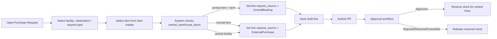

# 19_workflow_purchase-central-routing.md

## วัตถุประสงค์
อธิบาย flow ของ Purchase Request ที่ route อัตโนมัติจาก `central_warehouse_items` โดยไม่ให้ user เลือก source เอง

## หลักคิด
- `central_warehouse_items` คือ catalog ของ `central item`
- `facility_nodes.is_central_hub` บอกว่าฟาร์ม/สถานที่นี้คือคลังกลาง
- item ปกติ -> `ExternalPurchase`
- central item ของฟาร์ม -> `CentralBooking`
- PR ของคลังกลาง -> `ExternalPurchase` เท่านั้น
- ไม่มี split line ตาม stock
- ไม่มี fallback จาก central ไป external เพราะ stock

## Mermaid Flow

## UX Flow
1. User เปิดหน้าสร้าง PR
2. ระบบโหลด option จาก backend:
   - departments
   - facilities
   - warehouses
   - item master
   - `central_warehouse_items`
3. User เลือก facility, destination warehouse, request type, item, UOM, quantity, price, remark
4. User ไม่ได้เลือก source เอง
5. ระบบคำนวณ source ของแต่ละ line จาก item + facility + central catalog
6. ระบบสรุป `route_type` ของทั้งเอกสารจาก lines:
   - `CentralOnly`
   - `ExternalOnly`
   - `Mixed`
7. เมื่อบันทึก draft / submit ระบบส่งเฉพาะข้อมูล PR และ line ที่ user กรอก
8. backend เป็นคน derive routing และเขียนค่าที่เกี่ยวกับ source และ route summary ลง DB

## DB Mapping
### `purchase_requests`
เก็บ header ของเอกสาร
- `document_number`
- `request_date`
- `requestor_id`
- `facility_id`
- `destination_warehouse_id`
- `request_type`
- `urgency`
- `status`
- `department`
- `remarks`
- `route_type` ใช้เป็น summary สำหรับ report/query ระดับเอกสาร

### `purchase_request_lines`
เก็บข้อมูลของแต่ละ line
- `item_id` หรือ `pig_item_id`
- `quantity`
- `uom_id`
- `estimated_price`
- `request_source`
- `is_center`
- `source_warehouse_id`
- `reserved_quantity`
- `issued_quantity`

### `central_warehouse_items`
เก็บ catalog ของ central item
- `warehouse_id`
- `item_id`
- `is_center_item`
- `min_booking_quantity`
- `max_booking_quantity`

### `facility_nodes`
เก็บ flag ของคลังกลาง
- `is_central_hub`

### `stock_balances`
เก็บ stock จริงและยอด reserved
- `quantity`
- `reserved_quantity`

## Storage Behavior
- ตอน create draft: ยังไม่ reserve stock
- ตอน submit: ส่งเข้า approval workflow
- ตอน approve: reserve stock เฉพาะ line ที่ `is_center = true`
- ตอน reject / return / cancel: release stock เฉพาะ line ที่ `is_center = true`
- ตอน finalize receive: consume reservation ของ central line และอัปเดต `stock_balances.quantity` / `reserved_quantity`

## ตัวอย่าง
### ตัวอย่าง 1: item ปกติ
- User เลือก item ที่ไม่มีใน `central_warehouse_items`
- ระบบบันทึก line เป็น `ExternalPurchase`
- `source_warehouse_id = null`
- ไม่มีการ reserve stock กลาง

### ตัวอย่าง 2: central item
- User เลือก item ที่อยู่ใน `central_warehouse_items`
- ระบบบันทึก line เป็น `CentralBooking`
- `source_warehouse_id` ชี้ไปที่ warehouse กลางที่กำหนดไว้ใน catalog
- ตอน approve ค่อย reserve จาก `stock_balances`
- ตอน finalize receive ค่อย consume reservation และย้าย stock เข้า destination warehouse

### ตัวอย่าง 3: central facility
- User อยู่ที่ `facility_nodes.is_central_hub = true`
- ทุก line ถูกบันทึกเป็น `ExternalPurchase`
- ใช้สำหรับซื้อจาก vendor ภายนอกเข้าคลังกลาง

## สิ่งที่ UX ไม่ต้องทำ
- ไม่ต้องให้ user เลือก source เอง
- ไม่ต้องแยก line เพราะ stock ไม่พอ
- ไม่ต้องโชว์ logic fallback จาก central ไป external
- ไม่ต้องใช้ stock ฟาร์มเป็นตัว split PR
