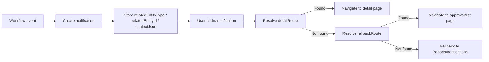
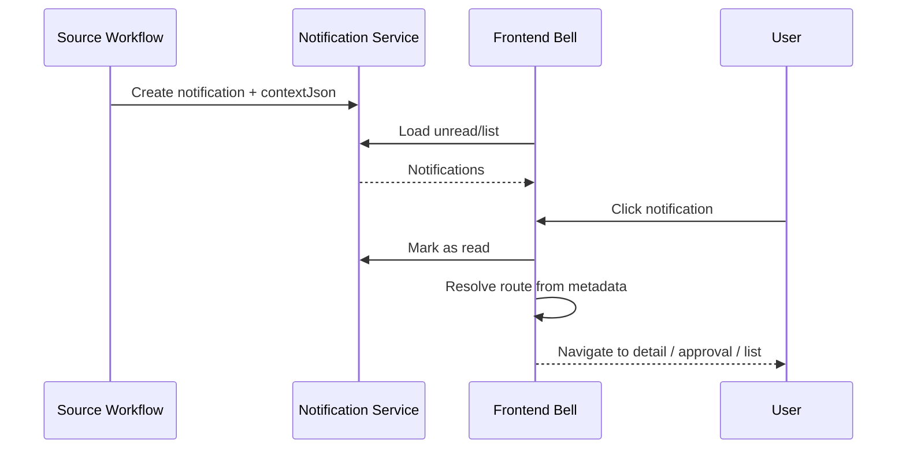

# 20_workflow_notification-routing.md

## วัตถุประสงค์
กำหนดแนวทางให้ notification ทำหน้าที่เป็น "routing กลาง" สำหรับหลายโมดูล เมื่อผู้ใช้กดแจ้งเตือนแล้วระบบพาไปยังหน้าที่ต้องทำหรือหน้ารายละเอียดที่เกี่ยวข้องได้ทันที

## หลักคิด
- ใช้ `notifications` table เดิมเป็นศูนย์กลาง
- ใช้ `relatedEntityType`, `relatedEntityId`, `notificationType`, `priority`, `contextJson` เป็น metadata สำหรับ route
- แต่ละ workflow เป็นคนสร้าง notification ของตัวเอง
- notification ต้องรองรับทั้ง
  - ไปหน้า detail โดยตรง
  - fallback ไปหน้า list / approval queue ของโมดูลนั้น

## ขอบเขตโมดูลที่รองรับ
- Purchase Request
- Building Opening Request
- Stock Issue Request
- งานอนุมัติอื่น ๆ ที่ต้องการพาผู้ใช้กลับไปทำงานต่อ

## Mermaid Flow

## Mermaid Sequence

## โครงข้อมูลที่ควรมี
### `notifications`
- `title`
- `message`
- `notification_type`
- `priority`
- `alert_key`
- `alert_state`
- `related_entity_type`
- `related_entity_id`
- `context_json`
- `user_id`
- `is_read`

### `contextJson` แนะนำให้เก็บ
- `documentNumber`
- `moduleCode`
- `detailRoute`
- `fallbackRoute`
- `actionKind` เช่น `detail`, `approval`, `list`

## กติกา Routing
1. ถ้ามี `detailRoute` ใน `contextJson` ให้ใช้ก่อน
2. ถ้าไม่มี ให้ใช้ `relatedEntityType` map ไปยังหน้าที่เหมาะสม
3. ถ้าเป็นงานอนุมัติ ให้ fallback ไป approval queue ของโมดูลนั้น
4. ถ้ายังหาไม่เจอ ให้ fallback ไป `/reports/notifications`

## ตัวอย่าง Routing Map
- `PurchaseRequest`
  - detail: หน้า PR detail
  - fallback: หน้ารออนุมัติ PR
- `BuildingOpeningRequest`
  - detail: หน้าเปิดโรงเรือน detail
  - fallback: หน้ารออนุมัติเปิดโรงเรือน
- `StockIssueRequest`
  - detail: หน้าใบตัดสต๊อก detail
  - fallback: หน้ารออนุมัติใบตัดสต๊อก

## สิ่งที่ Frontend ต้องทำ
- notification bell ต้อง mark as read ได้
- กด notification แล้ว resolve route ตาม metadata
- ถ้า resolve ไม่ได้ ต้องพาไปหน้า notifications list
- หน้า notifications list ยังใช้ดู history ทุกโมดูลได้

## สิ่งที่ Backend ต้องทำ
- แต่ละ workflow สร้าง notification ด้วย metadata ที่พอสำหรับ route
- ทำให้ response ส่งข้อมูลที่ frontend ใช้ route ได้ครบ
- ไม่บังคับสร้างตารางใหม่
- ไม่ผูก notification routing กับโมดูลคลังอย่างเดียว

## ข้อยกเว้น
- ถ้าเอกสารต้นทางยังไม่มี detail page เฉพาะ ให้ fallback ไป approval/list page ก่อน
- ถ้า notification มาจาก event ที่ไม่มี route ชัดเจน ให้แสดงใน `/reports/notifications`
- ถ้า notification เดียวมีหลาย target ให้เลือก route หลักที่ตรงกับงานที่สุดก่อน

## Checklist สำหรับการ implement
- [ ] ระบุ `relatedEntityType` และ `relatedEntityId` ให้ครบใน workflow ที่สร้าง notification
- [ ] นิยาม `contextJson.detailRoute` / `fallbackRoute`
- [ ] สร้าง route resolver กลางฝั่ง frontend
- [ ] รองรับ click-to-open และ mark-as-read ใน bell panel
- [ ] ทดสอบ fallback route สำหรับ PR / เปิดโรงเรือน / ใบตัดสต๊อก
